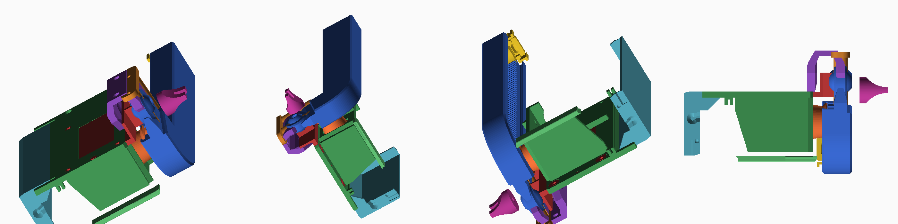

# OpenWindow — Zigbee-привод открывания окна на проветривание

Проект превращает 3D-печатный реечный привод из папки `pok016/`
в полноценное Zigbee-устройство: окно открывается и закрывается
из Home Assistant, по расписанию, по CO₂ или по датчику дождя.



## Что получится

- Устройство видно в сети как стандартная **штора (Window Covering)** —
  Home Assistant, Zigbee2MQTT и deCONZ понимают его без кастомных описаний.
- Команды: открыть / закрыть / стоп / **позиция в процентах**.
- **Защита от защемления** по току мотора: упёрлись — остановились и отъехали.
- Позиция переживает отключение питания.
- Ручное управление кнопкой на плате.

## С чего начать

Читайте по порядку — документы идут в том порядке, в котором делается работа:

| Документ | О чём |
|---|---|
| [1. Разбор макетов](docs/01-mechanics.md) | что за механизм в `pok016/`, все обмеры, чего в наборе не хватает |
| [2. Что купить](docs/02-bom.md) | список компонентов, выбор мотора, расчёт момента |
| [3. Печать и сборка](docs/03-print-and-assembly.md) | параметры печати, сборка узлов, установка на окно |
| [4. Электроника](docs/04-electronics.md) | схема, распиновка, монтаж, настройка защиты |
| [5. Прошивка](docs/05-firmware.md) | установка Arduino IDE с нуля, заливка, калибровка |
| [6. Умный дом](docs/06-integration.md) | сопряжение, ZHA/Z2M, готовые автоматизации |

## Коротко о железе

| | |
|---|---|
| Контроллер | ESP32-C6 (Zigbee 3.0 + Wi-Fi + BLE) |
| Драйвер | DRV8871 |
| Мотор | червячный мотор-редуктор 12 В, 20 об/мин, вал ⌀6 мм с лыской |
| Датчик тока | INA219 |
| Питание | 12 В / 3 А |
| Ход | 100 мм, полный цикл ~5 с |
| Бюджет | ≈ 4 000 ₽ вместе с мотором и печатью |

## Главное, что нужно знать до начала

1. **В наборе нет ведущей шестерни.** Нужна отдельная, металлическая:
   модуль 1, z = 18, ширина ≥ 9 мм, посадка ⌀6 мм с лыской. Подробности —
   в [разборе макетов](docs/01-mechanics.md), §1.3.
2. **Редуктор должен быть червячным.** Он самотормозящий, иначе ветер
   и вес створки будут продавливать рейку назад.
3. **Печатайте PETG, не PLA.** Привод стоит у окна и летом греется
   выше температуры размягчения PLA.
4. **Марка мотора из STL не восстанавливается.** Известен посадочный
   интерфейс (4×M3 сеткой 18 × 33 мм, вал ⌀6 с лыской); в
   [BOM](docs/02-bom.md) есть чек-лист проверки перед покупкой.

## Структура репозитория

```
pok016/                            исходные STL (как были загружены)
docs/                              документация
firmware/zigbee_window_opener/     скетч Arduino + config.h
tools/                             скрипты обмера и рендера STL
```

## Инструменты обмера

Все размеры в документации получены скриптами из `tools/` — их можно
перезапустить и проверить:

```bash
pip install numpy
python3 tools/stlinfo.py pok016       # габариты и объёмы
python3 tools/holes.py   pok016       # цилиндрические отверстия и их координаты
python3 tools/render.py  pok016 out/  # изометрии деталей в PNG
```

## Безопасность

Устройство двигает створку с усилием под 200 Н. Не собирайте его
без защиты по току, проверьте траекторию створки и оставьте
возможность отсоединить рейку от окна без инструмента.
Подробно — в [разделе 4](docs/04-electronics.md), §3.5.
