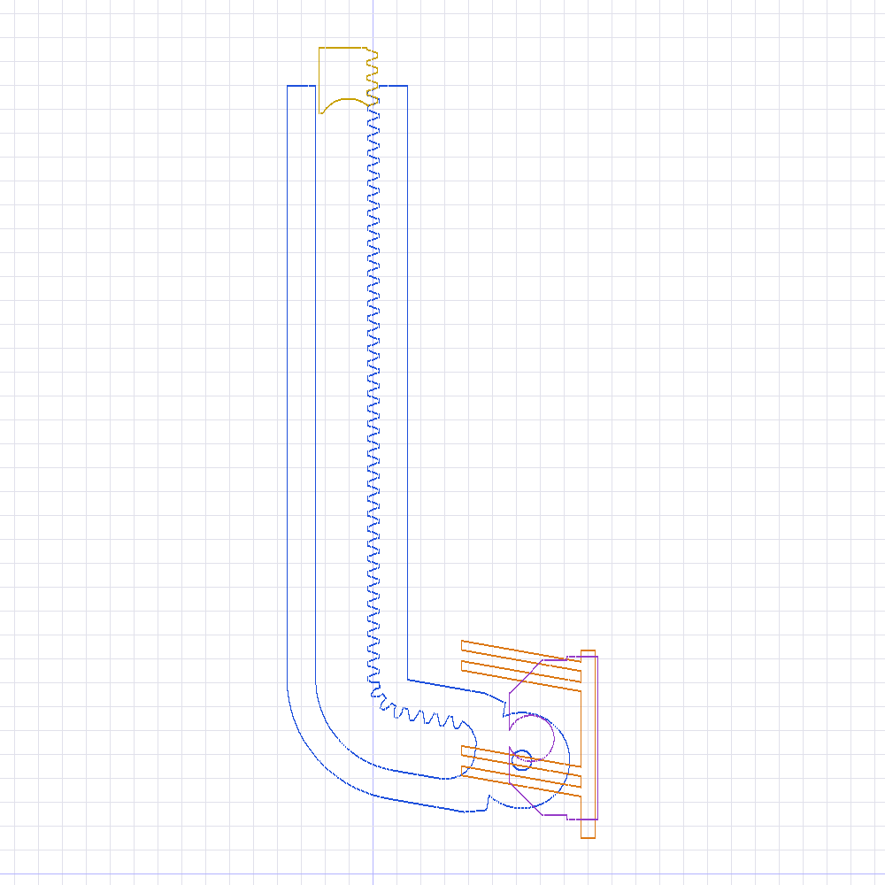
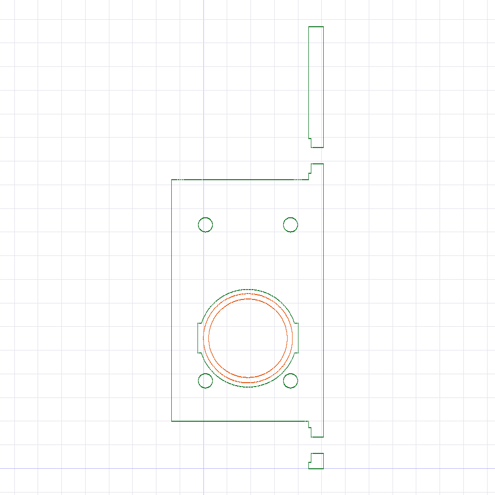
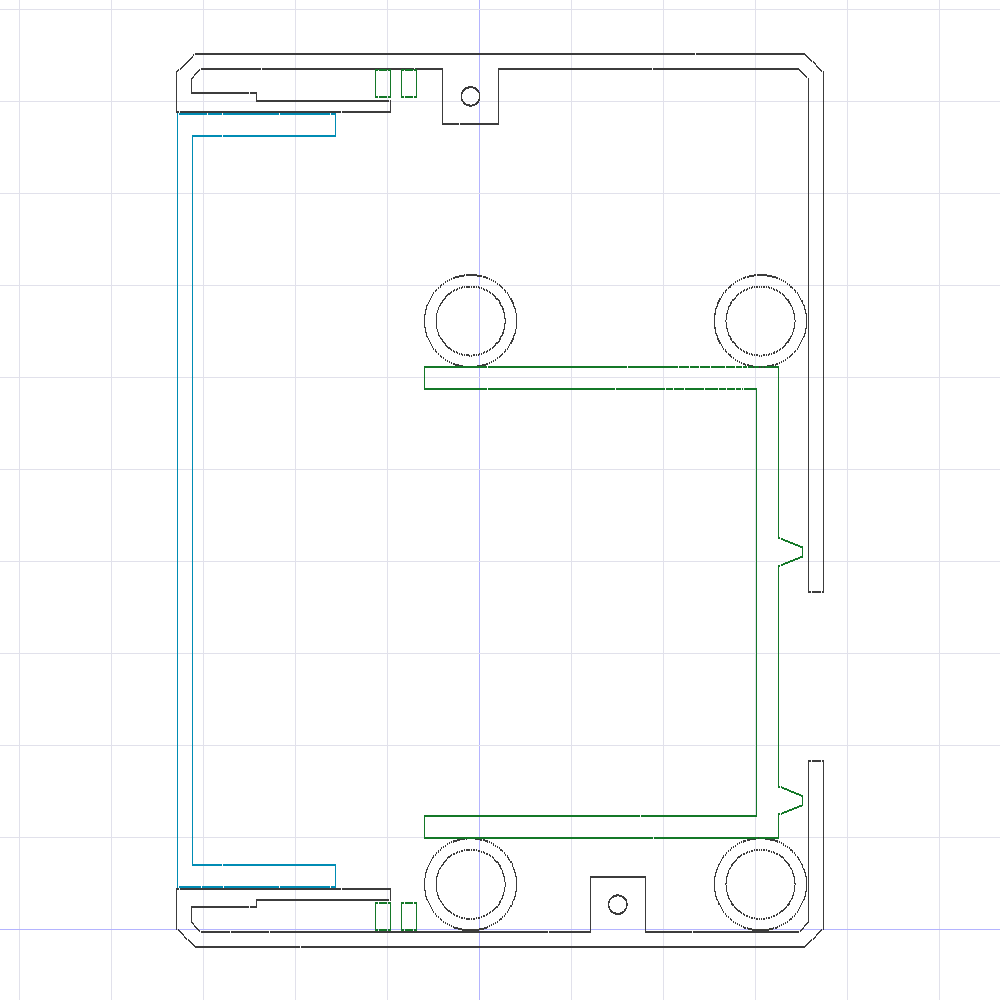

# 1. Разбор макетов из `pok016/`

Всё ниже — результат прямого обмера STL-файлов (скрипты лежат в `tools/`).
Исходного CAD и инструкции в репозитории нет, поэтому сборка восстановлена
по координатам: детали лежат в одной системе координат, то есть они уже
расставлены «как в сборке», а не по центру нуля.


## 1.1. Что это за механизм

Это **реечный привод (rack & pinion)** для откидного окна:
электромотор через шестерню двигает зубчатую рейку, рейка упирается в створку
и отжимает её на проветривание. Обратный ход — закрывает.

Ключевой момент, который определяет весь выбор электроники: **рейка Г-образная**.
Прямой зубчатый участок идёт вдоль корпуса, а внизу переходит в изогнутый «крюк»
с проушиной — она шарнирно крепится к створке. За счёт изгиба привод получается
компактным, а створка при этом отходит по дуге.



## 1.2. Таблица деталей

| Файл | Габарит, мм | Объём | Назначение |
|---|---|---|---|
| `pok16-openerRack.stl` | 15,8 × 59,2 × 152,0 | 38,8 см³ | Зубчатая рейка с крюком и проушиной |
| `pok16-openerCover.stl` | 70,2 × 37,4 × 97,0 | 34,6 см³ | Корпус целиком (мотор + электроника) |
| `pok16-openerMotoBase.stl` | 58,5 × 32,2 × 93,5 | 16,5 см³ | Рама с площадкой мотора, крепится к раме окна |
| `pok16-openerGuide1.stl` | 55,8 × 13,0 × 67,2 | 10,7 см³ | Г-образный кронштейн-направляющая |
| `pok16-openerLid.stl` | 20,5 × 33,8 × 84,0 | 8,7 см³ | Крышка отсека электроники |
| `pok16-openerFixer.stl` | 20,0 × 22,0 × 34,0 | 6,2 см³ | Кронштейн на створку (ответная часть) |
| `pok16-openerGuide2.stl` | 10,0 × 28,0 × 42,3 | 2,5 см³ | Прижимная направляющая рейки |
| `pok16-openerEndstop.stl` | 14,7 × 19,0 × 13,7 | 1,5 см³ | Ограничитель хода вверху |
| `pok16-openerFixerNut.stl` | 15,0 × 14,0 × 14,0 | 1,2 см³ | Ответная гайка/подложка к Fixer |
| `pok16-openerMotoFix.stl` | ⌀20,5 × 12,8 | 1,05 см³ | Коническая втулка-фиксатор вала |
| `pok016-MotoFix.stl` | ⌀20,5 × 12,8 | 1,05 см³ | То же самое, повёрнуто «под печать» |
| `pok16-openerMasker.stl` | 42,7 × 3,1 × 7,7 | 0,86 см³ | Накладка-заглушка |
| `pok16-openerGearSpacer.stl` | ⌀12 × 4,0 | 0,29 см³ | Дистанционная шайба на вал мотора |
| `pok16-openerMotoFixSuport.stl` | ⌀17,8 × 2,0 | 0,22 см³ | Опорная шайба под втулку |
| `pok16-openerOffTool.stl` | 18,0 × 0,4 × 23,5 | 0,11 см³ | Тонкий «ключ» для ручного расцепления |
| `pok16-openerMotoNut.stl` | ⌀7,3 × 1,2 | 0,04 см³ | Шаблон гнезда под гайку M4 |
| `pok16-openerLid-Insert.stl` | 21,2 × 31,6 × 78,9 | — | Вспомогательный «негатив» отсека электроники |
| `pok16-openerLid-Inset-Open.stl` | 26,1 × 31,6 × 78,9 | — | То же, вариант с проёмом |

Последние две — не печатаемые детали, а булевы заготовки из CAD.
Печатать их не нужно, но они очень полезны: `Lid-Insert` — это ровно тот объём,
который остаётся свободным под плату и провода.

## 1.3. Точные размеры, которые важны для сборки

### Зубчатое зацепление

| Параметр | Значение | Как измерено |
|---|---|---|
| Шаг зубьев | **3,142 мм** | расстояние между вершинами зубьев по STL |
| Модуль | **m = 1** | шаг / π = 3,142 / 3,1416 |
| Высота зуба | 2,25 мм | = 2,25 · m, стандартная пропорция |
| Ширина зуба (венца) | **9,0 мм** | рейка по X: 43,1…52,1 |
| Длина зубчатого участка | ~112 мм | прямая часть по Z: 45…157 |
| Ось шестерни | 9,25 мм от делительной линии рейки | центр отверстия ⌀21 минус линия зуба |

Отсюда шестерня: **модуль 1, z = 18, делительный ⌀18 мм, ширина ≥ 9 мм**.
Межосевое по модели 9,25 мм при теоретических 9,0 — заложено 0,25 мм зазора,
это нормальный люфт для FDM-печати.

> ⚠️ **Шестерни в наборе нет.** Из 18 файлов ни один не является ведущей
> шестернёй. Её нужно либо купить (латунная/стальная m1 z18 с посадкой ⌀6 мм
> под лыску), либо сгенерировать самому — я бы советовал купить металлическую:
> это самая нагруженная деталь привода.

### Вал мотора

`GearSpacer` — шайба ⌀12 × 4 мм с отверстием **⌀6 мм с лыской на 2,24 мм от оси**
(то есть «под ключ» 5,24 мм). Это прямо говорит:

> **вал мотора — ⌀6 мм, D-образный (со срезом).**

### Площадка мотора



- пластина толщиной 2,4 мм;
- **4 отверстия ⌀3,0 мм (под M3) прямоугольником 18 × 33 мм**;
- центральное отверстие ⌀≈21 мм под выходную втулку/бобышку редуктора;
- ось вала смещена: она на 9 мм ниже центра прямоугольника отверстий.

Это несимметричное расположение — «отпечаток» конкретного мотора.
Смотрите `docs/02-bom.md`, там процедура проверки перед покупкой.

### Крепление к раме окна

Общий для `MotoBase`, `Cover` и `Guide1` шаблон: **4 самореза, сетка 31,5 × 61,2 мм**.
- `MotoBase`: сквозные ⌀3,8 мм с зенковкой ⌀7,5 мм;
- `Guide1`: направляющие ⌀2,5 мм (кондуктор для сверления);
- `Cover`: бобышки ⌀10 мм, сквозь которые проходят те же саморезы.

Под саморез 4 × 30…40 мм по ПВХ-профилю.

### Крепление к створке

`Fixer` + `FixerNut`: два отверстия M3 (⌀3,3 с зенковкой ⌀6,2/6,5) и ось ⌀4,0 мм.
Проушина рейки — ⌀3,79 мм. Значит шарнир — **штифт или винт M4**.

## 1.4. Отсек электроники — сколько у нас места



Свободный объём под крышкой `Lid` (по «негативу» `Lid-Insert`):

> **21,2 × 31,6 × 78,9 мм**

Это ~53 см³. Немало, но узко: 21 мм — жёсткое ограничение по толщине.
Практический вывод для выбора компонентов:

- **влезает**: ESP32-C6 SuperMini (23 × 18 мм), драйвер DRV8871 (20 × 20 мм),
  понижающий модуль MP1584 (22 × 17 мм) — все три «столбиком» по высоте;
- **влезает с натягом**: ESP32-C6-DevKitC-1 (52 × 25,5 мм) — по ширине проходит,
  но USB-разъём придётся выводить наружу;
- **не влезает**: аккумулятор 18650 вместе с платами. Либо банка, либо электроника.

Поэтому базовый вариант в этом проекте — **питание от внешнего блока 12 В**,
а не автономный. Подробности и обоснование — в `docs/04-electronics.md`.

## 1.5. Что осталось неизвестным

Честно перечисляю, чего из STL получить нельзя:

1. **Точная модель мотора.** Известен посадочный интерфейс (4×M3 18×33 мм,
   вал ⌀6 с лыской, бобышка ⌀21), но не марка. Проверочная процедура — в BOM.
2. **Точное число зубьев шестерни** — 18 по расчёту, но допускаю 19 при другом
   расположении оси. Проверяется примеркой: рейка должна ходить без закусывания.
3. **Порядок сборки** от автора. Реконструкция по координатам даёт взаимное
   положение деталей, но не последовательность операций.

## 1.6. Как повторить обмер

```bash
pip install numpy
python3 tools/stlinfo.py pok016            # габариты и объёмы всех деталей
python3 tools/holes.py   pok016            # все цилиндрические отверстия
python3 tools/render.py  pok016 out/       # изометрии каждой детали в PNG
```
